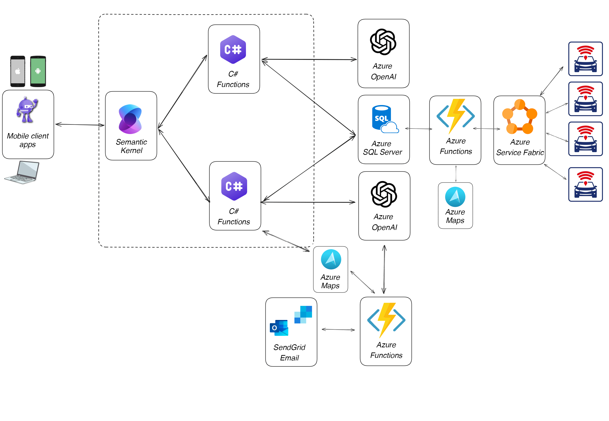

# Integration of Azure SQL Chat Agent into a MAUI app for a fleet management solution.

This chatbot runs on a MAUI mobile app and uses Azure SQL to store and retrieve vehicle data. It leverages both Retrieval-Augmented Generation (RAG) and Natural Language to SQL (NL2SQL) to enable chatting with both structured and unstructured data. The bot is built using the Microsoft Semantic Kernel Framework and the newly added support for vectors in Azure SQL. A service developed with Azure Service Fabric receives GPS location data and vehicle speed data, and, through an Azure Function, populates the SQL Server database.

📺 Here is the project demo video: [AI Agents Hackathon 2025 - APP DEMO Fleety Your AI Agent for Fleet Management](https://youtu.be/k9DfmCha_wg)

📺 This is the video presentation : [AI Agents Hackathon 2025 - Fleety Your AI Agent for Fleet Management](https://youtu.be/h9vcnfmAreo)

## Architecture

## Project Description

## Solution

The solution is composed of these components:

- [Azure Service Fabric](https://learn.microsoft.com/it-it/azure/service-fabric/service-fabric-overview): The orchestrator is responsible for syncing data with GPS devices.
- [Azure SQL Database](https://learn.microsoft.com/en-us/azure/azure-sql/database/sql-database-paas-overview?view=azuresql): The database that stores the data.
- [Azure Open AI](https://learn.microsoft.com/azure/ai-services/openai/): The language model that generates the text and the embeddings.
- [Semantic Kernel](https://learn.microsoft.com/en-us/semantic-kernel/overview/): The library used to orchestrate calls to LLM to do RAG and NL2SQL and to store long-term memories in the database.
- [MAUI Mobile App](https://dotnet.microsoft.com/en-us/learn/maui/): The MAUI application hosts and runs the intelligent agent.

### Azure Open AI

"Make sure to deploy two models: one for generating embeddings (the text-embedding-3-small model is recommended) and another for handling chat completions (a gpt model is recommended). You can use the Azure OpenAI Service to deploy these models. Ensure that you have the endpoint and API key ready.

### Configure environment 

There are three separate configuration files: one for the Azure Function, one for the Service Fabric, and one for the MAUI application.

The Azure Function and the MAUI application share the same configuration file format.

- `AzureOpenAIEndpointEmbedding`: specify the URL of your Azure OpenAI endpoint for embedding, eg: 'https://my-open-ai.openai.azure.com/'
- `AzureOpenAIEndpointChat`: specify the URL of your Azure OpenAI endpoint for chat, eg: 'https://my-open-ai.openai.azure.com/'
- `AzureOpenAIApiKeyEmbedding`: specify the API key of your Azure OpenAI endpoint for embedding
- `AzureOpenAIApiKeyChat`: specify the API key of your Azure OpenAI endpoint for chat
- `EmbeddingModelDeploymentName`: specify the deployment name of your Azure OpenAI embedding endpoint, eg: 'text-embedding-3-small'
- `ChatModelDeploymentName`: specify the deployment name of your Azure OpenAI chat endpoint, eg: 'text-embedding-3-small'
- `SqlConnectionString`: specify the connection string for azure sql
- `SqlChatMemoryTableName`: specify the name of the SQL table for chat history.
- `AtlasMapKey`: specify the name of the SQL table for chat history.
- `SyncfusionLicense`: syncfusion MAUI component license key
- `SendGridKey`: sendgrid license key
- `SendGridSender`: sendgrid authorized sendetr email address

The Service Fabric configuration file format.

- `APIServiceUrl`: the public URL of the deployed azure function

### Database

> [!NOTE]  
> Vector Functions are in Public Preview. Learn the details about vectors in Azure SQL here: https://aka.ms/azure-sql-vector-public-preview

To deploy the database, you can just use the 

That will deploy the needed database objects and some sample data.

## SendGrid

Create an account on the website and save the key.
Authorize a sender through the web configuration.

## Syncfusion license for MAUI

Request a community license from the Syncfusion website or purchase one.

## Azure Function

Deploy the Azure Function and configure it using the Azure Portal. 

Note the endpoint of the TrackerTrigger function (including its authorization function key)

## Service Fabric Application

Modify the Settings.xml according to the previous function endpoint and save it.

Deploy the Service Fabric Function to azure. 

## MAUI Application

Modify the appsettings.json according to the previous steps and save it.

Run 

## F.A.Q.

### How can I quickly run the .NET MAUI app on Windows, MacCatalyst, and iOS:

sudo dotnet build -t:Run -f net9.0-maccatalyst --configuration Release
dotnet build -t:Run -f net9.0-ios 
dotnet build -t:Run -f net9.0-ios -p:RuntimeIdentifier=ios-arm64 -p:_DeviceName=00008110-001A2CEA3462401E